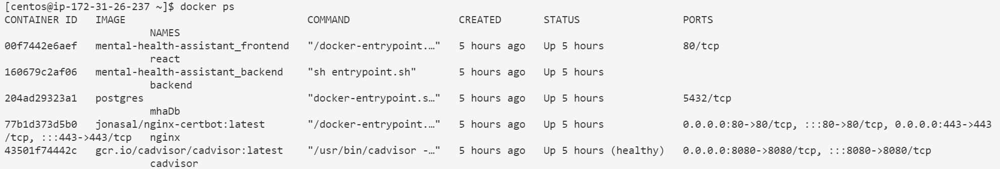
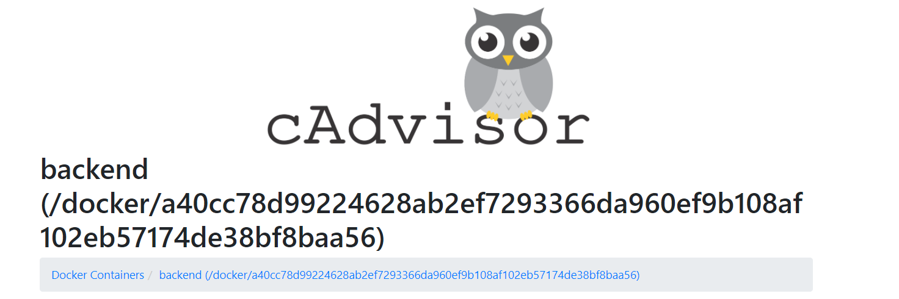

# Mental Health Assistant

Hello! Mental Health Assistant is a tool to help people struggling with health issues have a safe space to share their thoughts in a secure and personal manner.

## Project Requirements

**Web Server**: Our project has a backend API coded in Flask, as well as frontend in React. The Flask backend and React frontend have been containerized separately as well!

**Database**: We have a PostgreSQL Database for our project, which is also containerized separately.

**Containers**: We have five total containers (React frontend, Flask backend, nginx certbot, Postgres, and cadvisor).

**CI/CD**: We use Github Actions for auto-deploying to AWS, containerizing, and linting when we make pull requests and pushes to the main branch.

**Monitoring**: We use Cadvisor to monitor the state of our website.

**Deployment**: We are deployed to AWS on [mentalhealthme.tech](https://mentalhealthme.tech/) using nginx reverse proxy.




## Pre-requisites

- git
- python 3
- pip
- node
- docker

## Tech Stack Used

Flask (Python), React (JS), PostgreSQL

## Installation

Clone and cd to repo

Use developement .env file in **backend** folder.

```bash
$ cp ./backend/example.env ./backend/.env
```

Initialize db using the command while in the backend folder:

```bash
$ flask db init
```

Start the containers in the root folder using:

```bash
$ docker-compose up
```

## Contributing
